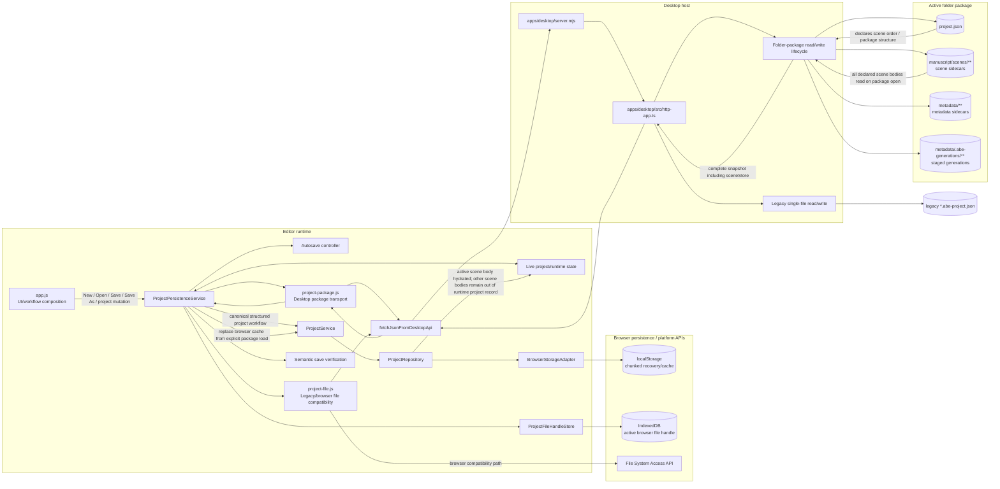
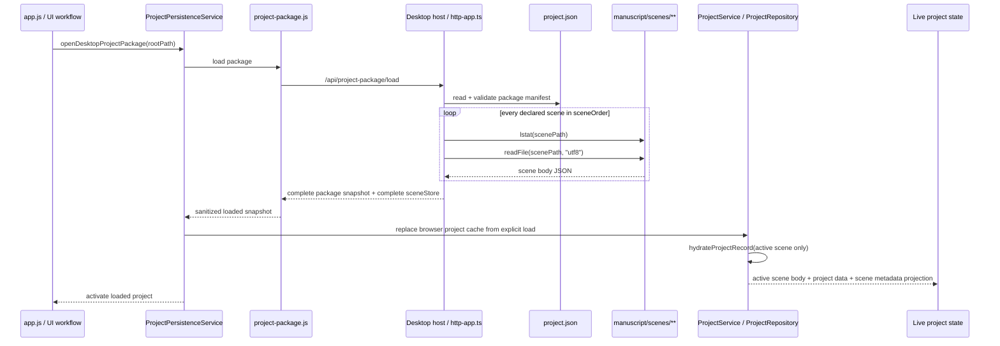

# AS-IS Persistence Architecture

Status: **AS-IS**  
Verified against commit: `0e5ad0ed8bbf53493d0295f466c913c4e6387363`  
Verified on: **2026-09-15**  
Scope: structured project persistence on `feature/persistence-portability-harness`, including New/Open/Save/Save As/autosave, the desktop folder package, legacy single-file compatibility, browser cache, and active-scene runtime hydration. Binary/media asset persistence is outside the main ownership claim except where it intersects the structured project boundary.  
Relationship semantics: arrows in the topology diagram mean runtime calls, data transfer, or durable-storage flow as labelled. Arrows in the sequence diagram mean chronological runtime calls/data return.

This map is pinned to the exact commit above. If relevant persistence implementation changes after that commit, use this document as orientation until the affected relationships are re-verified against source.

## Current architecture in one line

**Chunked durable package storage -> eager desktop/API package hydration -> lazy active-scene browser/runtime projection.**

The package is physically split into manifest/scene/metadata sidecars, but desktop package open currently reads every declared scene sidecar before returning the snapshot to the editor. Lazy scene-body projection happens later in the browser repository/runtime layer; it is not currently disk/API-level lazy scene loading.

## Structured project persistence topology

### Interpretation

`app.js` composes the storage services and routes normal structured project lifecycle actions through `ProjectPersistenceService`. That service coordinates canonical project mutations, package save/open workflows, autosave, semantic verification, project-file/package adapters, and browser recovery/cache updates.

`ProjectService` and `ProjectRepository` own the editor-side structured project repository path. `ProjectRepository` persists a chunked browser representation behind `BrowserStorageAdapter`, which isolates direct `localStorage` access. This browser storage is a recovery/performance compatibility layer; it is not the authoritative desktop package when an active package exists.

The desktop package transport crosses the editor/desktop boundary through `project-package.js` -> `fetchJsonFromDesktopApi` -> `server.mjs` -> `http-app.ts`. `http-app.ts` owns the folder-package lifecycle: manifest loading, scene/metadata sidecars, staged Save/Save As data, verification readback, and commit/discard operations.

A desktop package open is currently eager at the host/API boundary. The host reads `project.json`, walks each project's declared `sceneOrder`, reads every scene sidecar, builds a complete `sceneStore`, and returns that complete snapshot to the editor. The editor repository then hydrates only the active scene body into the runtime project record while retaining non-body scene metadata separately.

## Cold folder-package open

The key architectural consequence is that chunked storage does **not** currently imply physical lazy loading. The scene files are individually stored, but the desktop host still reads them all during package load before the browser performs its active-scene-only runtime projection.

## Save / Save As authority model

For an existing folder package, package saving is staged rather than immediately replacing the authoritative manifest. The persistence service keeps the current destination authoritative while the desktop host writes staged package data, reloads it, and allows semantic verification before commit. Staged sidecars/generation data are written under generation-specific paths and the staged manifest is published as `project.json` only after the save is accepted.

Save As follows the same authority principle: the prior destination remains authoritative until the new package has been written, reopened/read back, verified, and adopted. A failed Save As must not silently switch active authority to the failed destination.

Legacy `*.abe-project.json` persistence remains a separate compatibility path. Browser File System Access handles are isolated behind `ProjectFileHandleStore`/IndexedDB, while desktop legacy-file API routes remain distinct from the folder-package lifecycle.

## Evidence ledger

| ID | Architectural claim | Source evidence | Verification |
| --- | --- | --- | --- |
| A1 | `app.js` composes browser storage, repositories, `ProjectService`, and `ProjectPersistenceService` | `apps/editor/public/app.js` | construction path traced |
| A2 | Normal structured project lifecycle operations enter `ProjectPersistenceService` | `apps/editor/public/app.js`; `apps/editor/public/adapters/storage/project-persistence-service.js` | runtime calls traced for mutation, Save, New, Open, Save As |
| A3 | Canonical structured project mutation delegates durable project-state handling through `ProjectService` | `apps/editor/public/adapters/storage/project-persistence-service.js` — `commitCanonicalProjectMutation`; `apps/editor/public/adapters/storage/project-service.js` | call path traced |
| A4 | Browser structured project persistence is isolated behind `ProjectRepository` and `BrowserStorageAdapter` | `apps/editor/public/adapters/storage/project-repository.js`; `apps/editor/public/adapters/storage/browser-storage-adapter.js` | repository -> adapter -> `localStorage` traced |
| A5 | Browser project cache is chunked into library/manifest and per-scene keys | `apps/editor/public/adapters/storage/project-repository.js` | key construction and adapter operations traced |
| A6 | Explicit file/package load can replace stale browser cache rather than merging unrelated cache state | `apps/editor/public/adapters/storage/project-persistence-service.js`; `apps/editor/public/adapters/storage/project-repository.js` | `replaceExistingCache` path traced |
| A7 | Browser runtime hydration keeps the active scene body in the hydrated project record while exposing metadata separately | `apps/editor/public/adapters/storage/project-repository.js` — `hydrateProjectRecord`, scene metadata projection | hydration logic traced |
| A8 | Browser project file handles are persisted separately in IndexedDB | `apps/editor/public/adapters/storage/project-file-handle-store.js` | IndexedDB DB/store/key path traced |
| A9 | Desktop folder-package traffic uses `project-package.js` and the editor-to-desktop JSON bridge | `apps/editor/public/adapters/storage/project-package.js`; `apps/editor/public/app.js` — `fetchJsonFromDesktopApi` | client route path traced |
| A10 | `server.mjs` delegates desktop HTTP handling to `http-app.ts` | `apps/desktop/server.mjs`; `apps/desktop/src/http-app.ts` | host composition traced |
| A11 | A folder-package load reads `project.json` and eagerly reads each declared scene sidecar into a complete `sceneStore` | `apps/desktop/src/http-app.ts` — package load/read helpers and `readSceneStoreFromManifest` | manifest -> `sceneOrder` -> per-scene `lstat`/`readFile` loop traced |
| A12 | Existing-package Save uses staged manifest/generation data, readback, and explicit commit/discard lifecycle | `apps/desktop/src/http-app.ts` — `/api/project-package/save-stage`, `/save-load`, `/save-commit`, `/save-discard` | routes + staged filesystem lifecycle traced |
| A13 | Legacy single-file persistence remains a separate compatibility path from folder packages | `apps/editor/public/adapters/storage/project-file.js`; `apps/desktop/src/http-app.ts` | legacy browser/desktop transport traced |

### Negative verification

Within the audited structured-project scope, normal New/Open/Save/Save As/autosave flows were traced through the persistence service and its storage adapters rather than treating `localStorage` as the desktop durable authority.

This document deliberately does **not** claim that `ProjectPersistenceService` is the universal owner of every project-owned filesystem write. Feature-specific binary/media storage routes exist, so media/asset persistence must be audited separately before making an exclusivity claim across all project-owned files.

## Source areas inspected

- `apps/editor/public/app.js`
- `apps/editor/public/adapters/storage/project-persistence-service.js`
- `apps/editor/public/adapters/storage/autosave.js`
- `apps/editor/public/adapters/storage/project-service.js`
- `apps/editor/public/adapters/storage/project-repository.js`
- `apps/editor/public/adapters/storage/browser-storage-adapter.js`
- `apps/editor/public/adapters/storage/project-file-handle-store.js`
- `apps/editor/public/adapters/storage/project-file.js`
- `apps/editor/public/adapters/storage/project-package.js`
- `apps/desktop/server.mjs`
- `apps/desktop/src/http-app.ts`

## Unresolved / intentionally excluded from this AS-IS map

- Full project-owned binary/media asset topology, including narration and worldbuilding image writers, is not mapped here.
- This map does not present the proposed targeted scene-sidecar lazy-loading refactor as current architecture.
- This map does not treat design notes or intended contracts as proof of a runtime edge unless the production source path was traced.

## Maintenance triggers

Re-verify the affected portion of this map when architecture changes materially in any of these areas:

- `apps/editor/public/app.js`
- `apps/editor/public/adapters/storage/**`
- `apps/desktop/server.mjs`
- `apps/desktop/src/http-app.ts`
- desktop project-package API routes or package manifest format
- project repository hydration strategy
- active destination / Save As authority lifecycle

If a later source inspection contradicts this map, source wins. Report the discrepancy and update the AS-IS map against a new exact commit SHA rather than silently carrying forward an outdated relationship.
