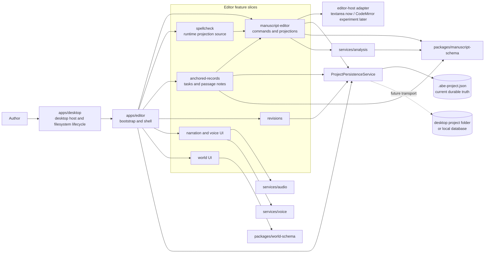
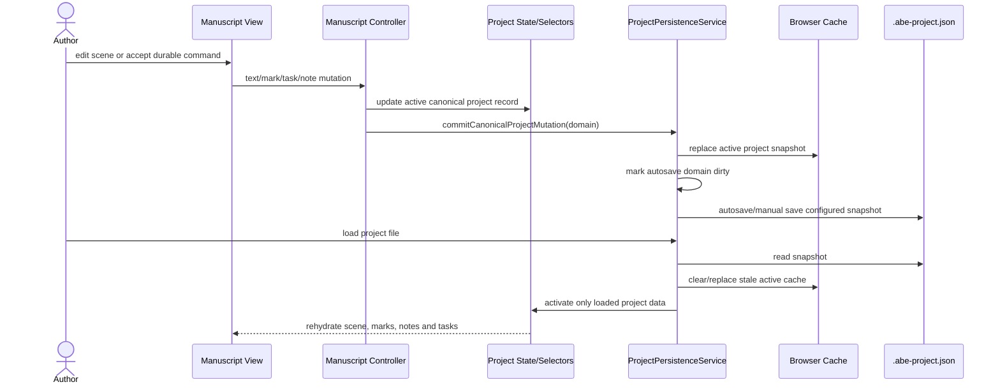
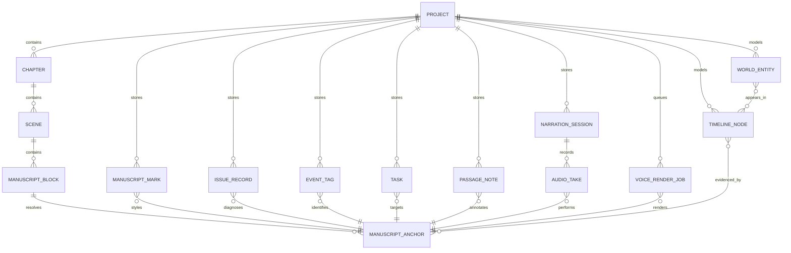
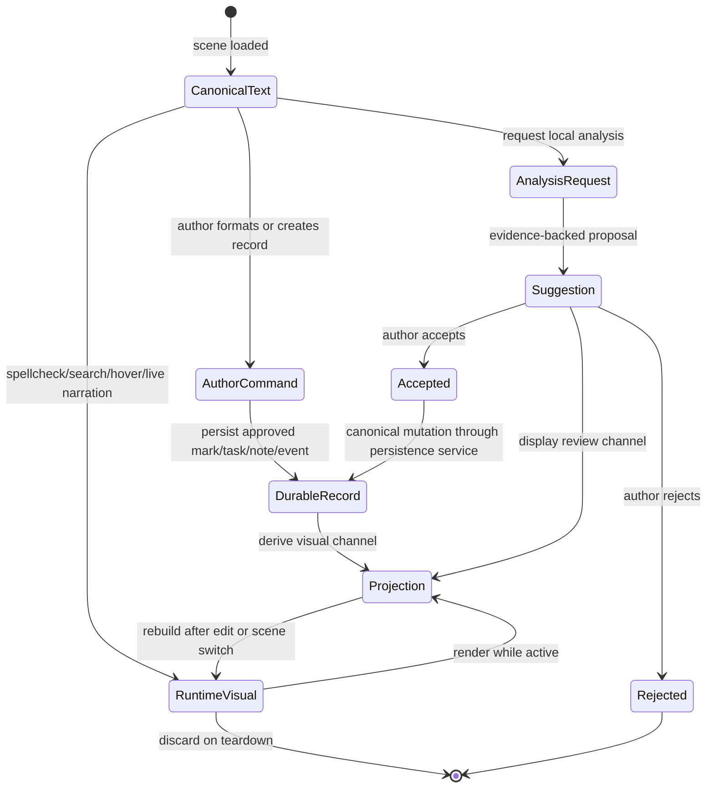

# Editor Boundary Diagrams

## Purpose

These lightweight Mermaid diagrams record ownership and data-flow decisions needed during the editor-shell extraction. They describe the migration target and current compatibility boundaries; they are not a function-by-function UML inventory of `apps/editor/public/app.js`.

## Component Boundary

This view keeps feature UI, storage transport, canonical data, and provider services distinct while `app.js` is reduced to composition and compatibility wiring.

## Durable Edit And Persistence Sequence

The active JSON project file is the durable transport today. Cache may assist reopening, but cannot merge stale author data into a loaded project.

## Durable Project Relationships

This is a conceptual ER/domain view for referential rules enforced in project JSON and schema code. It does not imply an existing relational database.

Compatibility note: `inlineFormatRanges` currently persists author formatting within scene chunks until `MANUSCRIPT_MARK` is implemented as an anchor-backed canonical schema record.

## Projection And Suggestion Lifecycle

Only author-approved records and marks become durable project data. Editor channels used for review, diagnostics, spelling, selection, or narration remain reconstructable projections.

## Maintenance Rule

Update these diagrams when ownership, the project persistence transport, canonical anchor relationships, or the suggestion acceptance lifecycle changes. Do not expand them to mirror temporary function layout inside `app.js`.
